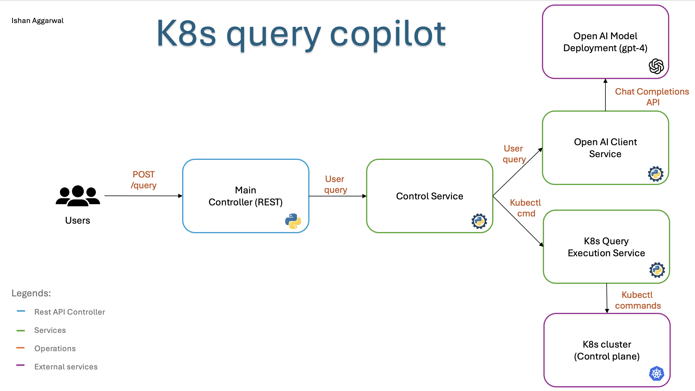

# **K8s Query Copilot**


## **Overview**
K8s Query Copilot is an intelligent Kubernetes assistant that translates natural language queries into actionable `kubectl` commands using OpenAI's GPT-4. This tool bridges the gap between human-readable queries and Kubernetes operations, simplifying cluster management tasks. It can answer queries about pods, services, deployments, and other cluster resources deployed on a Kubernetes cluster.

The project is designed to:
1. Parse user queries into Kubernetes commands.
2. Execute the generated `kubectl` commands on a Kubernetes cluster.
3. Return concise and accurate results to the user.

## **Features**
- **AI-Powered Command Generation**: Leverages GPT-4 for natural language understanding and prompt engineering.
- **Dynamic Kubernetes Operations**: Generates and executes `kubectl` commands dynamically based on user queries.
- **REST API Interface**: A simple and intuitive POST API for query submission.
- **Logging**: Detailed logs are saved in `agent.log` for debugging and tracking.
- **Extensible Design**: Easily integrates caching, authentication, and retry mechanisms.

---

## **Pre-requisites**
To run this project locally, ensure you have the following:
- **Python Version**: `3.10` (or higher).
- **Minikube**: Install and start a local Kubernetes cluster using [Minikube](https://minikube.sigs.k8s.io/docs/start/).
  - Command to start Minikube: 
    ```bash
    minikube start
    ```
- **Install Python Dependencies**:
  Use `pip` to install the required Python libraries.
  ```bash
  pip install -r requirements.txt
  ```
- **OpenAI API Key**:
  Get your OpenAI API key from [OpenAI](https://platform.openai.com/signup/) and set it as an environment variable:
  ```bash
  export OPENAI_API_KEY=<your-api-key>
  ```

---

## **Start the Server**
Run the following command to start the Flask server:
```bash
python main.py
```
The server will start on `http://localhost:8000`.

---

## **Run the API**
Send a POST request to the `/query` endpoint with a JSON payload containing your query.

### **API Endpoint**
- **URL**: `http://localhost:8000/query`
- **Method**: `POST`
- **Payload Example**:
  ```json
  {
      "query": "How many pods are in the default namespace?"
  }
  ```

### **Example Queries**
| Query                                      | Result                    |
|--------------------------------------------|---------------------------|
| `"How many pods are in the default namespace?"` | `2`                       |
| `"What is the status of the pod named nginx?"` | `"Running"`               |
| `"Get logs for pod my-app."`               | `"<logs output>"`         |

---

## **Architecture/Design**

The system is built with a modular architecture for extensibility and maintainability.
---



---
### **Components**
1. **REST API Controller**:
   - Handles user queries via POST requests.
   - Validates requests using `Pydantic`.
2. **OpenAI Client Service**:
   - Converts natural language queries into Kubernetes commands using GPT-4.
3. **Execution Service**:
   - Executes the generated `kubectl` commands and fetches results.
4. **Logging**:
   - Tracks all queries, commands, and responses in `agent.log`.
---
## **Advantages of This Architecture**
- **Separation of Concerns**:
  - Each service (REST API, OpenAI client, and execution service) is isolated, improving scalability.
- **Scalability**:
  - Additional services like caching or authentication can be added seamlessly.
- **Logging and Debugging**:
  - Detailed logs in `agent.log` provide transparency and easy debugging.

---

## **Some Benefits**
- **Ease of Use**: No need to memorize complex `kubectl` commands.
- **AI-Assisted Operations**: Automates Kubernetes management tasks.
- **Extensibility**: Modular design allows easy integration of new features.
- **Logs**: All operations and errors are logged for transparency and debugging.

---

## **Future Improvements**
1. **Authentication**:
   - Add authentication to the main controller to ensure secure access.
2. **Prompt Engineering**:
   - Refine GPT-4 prompts for even more precise command generation.
3. **Retry Mechanism**:
   - Implement retries for OpenAI API calls in case of external call failures.
4. **Two-Way Agent Communication**:
   - If GPT-4 generates an invalid command, implement feedback loops to regenerate correct commands.
5. **Caching Layer**:
   - Integrate a caching mechanism to reduce OpenAI API calls for frequently used queries.
     - **Advantage**: Cost savings.
     - **Disadvantage**: Managing cache consistency.
6. **Enhanced Resiliency**:
   - Add failover strategies and fallback mechanisms for better error handling.

---


---

## **License 📜**
This project is licensed under the **MIT License**. See the [LICENSE](LICENSE) file for details.

---
```


# **Cleric Query Agent Assignment**

## Introduction
This document outlines the requirements and guidelines for the Cleric Query Agent Assignment. Your task is to develop an AI agent capable of accurately answering queries about applications deployed on a Kubernetes cluster.

## Objective
Create an AI agent that interacts with a Kubernetes cluster to answer queries about its deployed applications.

## Assignment Details

### Technical Requirements
- Use Python 3.10
- The kubeconfig file will be located at `~/.kube/config`
- Utilize GPT-4 or a model with comparable performance for natural language processing

### API Specifications
Your agent should provide a POST endpoint for query submission:
- URL: `http://localhost:8000/query`
- Port: 8000
- Payload format:
  ```json
  {
      "query": "How many pods are in the default namespace?"
  }
  ```
- Response format (using Pydantic):
  ```python
  from pydantic import BaseModel

  class QueryResponse(BaseModel):
      query: str
      answer: str
  ```

### Scope of Queries
- Queries will require only read actions from your agent
- Topics may include status, information, or logs of resources deployed on Minikube
- Answers will not change dynamically
- Approximately 10 queries will be asked
- Queries are independent of each other
- Return only the answer, without identifiers (e.g., "mongodb" instead of "mongodb-56c598c8fc")

## Submission Guidelines
Submit your repository to [submission link](https://query-agent-assignment-validator-347704744679.us-central1.run.app/)
 - The validator will return your score within a few minutes
 - Use logging if you want to check your outputs, make sure write logs to `agent.log`
 - If you encounter errors, wait a few minutes before retrying
 - Do not refresh the browser to avoid losing your session
 - Make sure to note your `Submission ID` for the Google form for the final submission.

### Submission Requirements
1. GitHub Repository
   - Include a `README.md` file describing your approach
   - Ensure your main script is named `main.py`
2. Loom Video
   - Keep it informal and personal
   - Focus on your motivation and background
3. Submit the `Loom video` and `submission ID` for the final submission on this [Google Form Link](https://docs.google.com/forms/d/e/1FAIpQLScUpEklWG-hYCIsBFo9pD-SAtyaCsevhQSz6XRLKkLV_K3KuQ/viewform?usp=sf_link)

## Submission Deadline:
There is no specific deadline for submitting this assignment;  however, we expect it to be completed within a **reasonable amount of time**. 
- We understand that personal and professional responsibilities can take priority, 
and we encourage you to balance this assignment with your other commitments. 
- Please aim to submit your work once you feel confident in your solution and it aligns with the objectives.

## Testing Your Agent
We recommend testing your agent locally before submission:
1. Install [Minikube](https://minikube.sigs.k8s.io/docs/start/)
2. Set up a local Kubernetes cluster
3. Deploy sample applications
4. Run your agent and test with sample queries

## Evaluation Criteria
- Accuracy of answers
- Code quality and organization
- Clarity of explanation in README and video

## Example Queries and Responses
1. Q: "Which pod is spawned by my-deployment?"
   A: "my-pod"
2. Q: "What is the status of the pod named 'example-pod'?"
   A: "Running"
3. Q: "How many nodes are there in the cluster?"
   A: "2"
